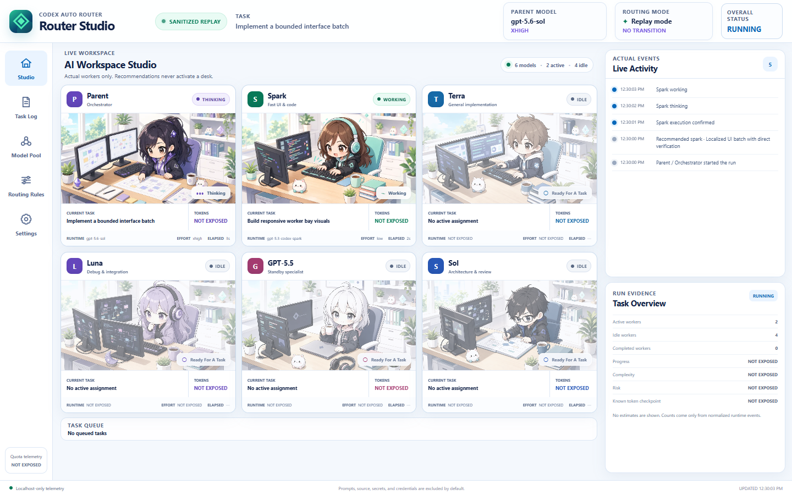

# Codex Auto Router

Quality-aware parent/worker model routing for Codex.

> **Use the cheapest capable worker without lowering the engineering quality bar.**

Codex Auto Router decomposes software-engineering work, delegates bounded subtasks to model-specific workers, automatically escalates/downgrades as evidence changes, and keeps verification standards invariant across handoffs.

## Codex Router Studio

Router Studio is the live, local observability surface for Auto Router. It renders the parent and every model tier as a bright anime-inspired 2D office simulation, with explicit `WORKING`, `THINKING`, `WAITING`, `IDLE`, `VERIFYING`, `BLOCKED`, and `DONE` states.



The six original workstation illustrations are repository-hosted, optimized `960×600` WebP assets. They share one locked chibi art bible and contain no generated UI text, logos, or dynamic status labels. Runtime status remains accessible HTML/CSS layered over the art; see [`references/studio-art.md`](references/studio-art.md) for the asset manifest, generation prompts, and validation checklist.

The Studio is deliberately evidence-driven:

- a recommendation does not activate a worker;
- a spawn request does not activate a worker;
- a worker activates only after its own Codex rollout confirms the executing model in `turn_context` evidence;
- missing token values render as `NOT EXPOSED`, never zero;
- progress, complexity, risk, and quota telemetry remain `NOT EXPOSED` unless a trustworthy runtime source provides them;
- raw prompts, source code, environment variables, and tool output are not displayed by default.

### Architecture

| Module | Responsibility |
|---|---|
| Codex rollout adapter | Normalizes real session, model, child-rollout, lifecycle, verification, and token-checkpoint evidence. |
| Studio state model | Applies truthful worker transitions and holds `DONE` briefly before returning a completed worker to `IDLE`. |
| Local transport | Serves the UI and an SSE event stream on `127.0.0.1`; lifecycle writes require an ephemeral local token. |
| Studio UI | Renders six responsive illustrated workstations, state overlays, activity feed, queue, route, timing, usage, worker inspector, and working navigation sections. |
| Replay adapter | Replays checked-in sanitized JSONL without access to local Codex session files. |

The normalized Studio event interface is the seam between runtime evidence and presentation. Live rollouts and replay logs use the same reducer and UI.

See [`references/studio-runtime.md`](references/studio-runtime.md) for the evidence contract and privacy model.

### Install and launch

Router Studio requires Node.js 20.19 or newer.

```bash
git clone https://github.com/vinsliu626/codex-auto-router.git
cd codex-auto-router
npm ci
npm run build
npm run studio -- start --auto
```

`start --auto` selects the most recently updated rollout under `CODEX_HOME/sessions`, starts the server on `http://127.0.0.1:4317`, watches matching child rollouts, and attempts to open a separate browser page. Codex does not currently expose a project-controlled native popup interface, so this is an ordinary local browser window/page—not a claimed native Codex panel.

Use `--no-open` in headless environments and open the printed URL yourself. Disable Studio startup with either `--disabled` or `CODEX_ROUTER_STUDIO=0`.

To follow a specific session instead of auto-detection:

```bash
npm run studio -- start --rollout /path/to/rollout.jsonl --no-open
```

### Replay and development

The checked-in fixture is sanitized and works without Codex credentials or local session access:

```bash
npm run replay
npm run replay:validate
```

Development and quality commands:

```bash
npm run dev
npm run typecheck
npm run lint
npm test
npm run build
npm run check
```

`npm run dev` builds and launches the local Studio against the latest rollout. Rerun it after source edits; it is intentionally a small dependency-light server rather than a framework-specific development stack.

### Parent lifecycle bridge

Live worker execution comes only from runtime adapters. The token-protected bridge can add parent-owned routing, queue, warning, and verification context, but the server rejects bridge attempts to create or complete workers.

```bash
npm run studio -- emit --type routing.recommended --to spark --reason "Bounded UI batch"
npm run studio -- emit --type routing.transition --from spark --to luna --reason "Integration risk discovered"
npm run studio -- emit --type verification.started --verification "Production build"
npm run studio -- emit --type verification.completed --verification "Production build" --result PASS
```

The launch command writes an ephemeral `.codex-router-studio/connection.json` file containing the local URL and event token, removes it on clean shutdown, and the directory is ignored by Git.

### Real runtime validation

When Codex CLI authentication and `gpt-5.3-codex-spark` are available, this command starts a live Studio, confirms the current parent from its rollout, launches a real read-only Spark worker, attaches the worker's own rollout, runs the repository test suite as visible parent verification, and writes a sanitized report under `artifacts/`:

```bash
npm run validate:runtime -- --parent-rollout /path/to/current-parent-rollout.jsonl --open
```

The validator fails if the requested and rollout-confirmed worker models differ, if Spark never completes/returns idle, if the parent cannot be confirmed, if another model is falsely activated, or if verification fails.

### Troubleshooting

- **All workers stay IDLE:** no actual child rollout was found. A recommendation is intentionally insufficient. Pass the exact parent rollout with `--rollout` and confirm the runtime writes child sessions under the same dated session directory.
- **Parent is not visible:** `turn_context` model evidence was not present or the wrong rollout was selected. Use an explicit `--rollout` path.
- **Usage says NOT EXPOSED:** the runtime did not publish that token field. This is expected and is not treated as zero.
- **Browser did not open:** use `--no-open` and visit the printed localhost URL. GUI launching may be unavailable in remote/headless environments.
- **Port already in use:** select another local port with `--port 4318`.
- **Replay works but live mode does not:** replay validates the Studio itself; inspect whether the current Codex build persists `session_meta`, `turn_context`, and lifecycle events in JSONL.

## Model ladder

| Tier | Role |
|---|---|
| **Spark** | Mechanical work, UI/layout, tiny/localized fixes, lightweight debugging |
| **Terra** | Normal coding, clear requirements, medium implementations |
| **Luna** | Complex debugging, multi-file semantic changes, integrations |
| **GPT-5.5** | Evidence-based compatibility/specialist fallback |
| **Sol + xhigh** | Architecture, extreme debugging, critical review, large-project planning, high-risk work |

Exact model IDs can change. The router must use models actually available in the current Codex runtime and report substitutions honestly.

## Verified runtime experiment

A real Codex runtime experiment verified the important underlying mechanism:

- parent: `gpt-5.6-sol / xhigh`;
- worker: `gpt-5.3-codex-spark / low`;
- task: localized game-HUD UI implementation;
- Spark actually modified the project through a separate worker rollout;
- parent verification afterward: typecheck PASS, lint PASS, 21/21 tests PASS, build PASS, browser interaction PASS.

The Spark worker's exact recorded checkpoint usage was 1,035,815 input tokens, including 973,440 cached input tokens, 5,766 output tokens, and 1,041,581 total tokens. These values describe that worker rollout, not a claim about whole-project savings.

This proves **model-specific parent → worker delegation is technically possible in the tested Codex runtime**. It does **not** by itself prove that the Auto Router policy is already selecting models correctly; dynamic routing remains a separate benchmark target.

## Core invariant

**Model downgrade never means quality downgrade.**

Acceptance criteria, project conventions, security constraints, architecture decisions, build/typecheck/lint expectations, tests, regression checks, and evidence requirements survive every handoff.

## How it works

1. Parent inspects the task/repository.
2. Assess semantic scope, uncertainty, blast radius, reversibility, and verification difficulty.
3. Split heterogeneous work into independently verifiable subtasks.
4. Select the cheapest safe worker.
5. Delegate through the runtime's real model-specific worker/subagent mechanism.
6. Batch coherent cheap work to avoid repeated context startup cost.
7. Re-evaluate as evidence changes.
8. Escalate immediately when hidden complexity/risk appears.
9. Downgrade after premium reasoning is complete and invariants are frozen.
10. Parent/integrator runs final quality gates.

A large project can use Sol briefly for architecture, Spark for a coherent UI batch, Terra for normal implementation, Luna for integration debugging, and Sol again only for genuinely critical review.

## Priority

**Quality > correctness risk > efficiency > premium-model exposure > total quota savings**

The project is particularly interested in reducing **Premium Token Exposure**: how much project processing actually requires Sol-class models. Total tokens can sometimes increase because workers reload context, so fewer total tokens is not the only useful optimization target.

## Worker batching

The verified Spark experiment also showed substantial cached context processing. Therefore Auto Router should not spawn a new worker for every tiny edit. Coherent work sharing model, subsystem, risk, and verification requirements should be batched when safe.

## Runtime truthfulness

Never claim a model switch because the policy recommended one. A routed task counts only when the runtime actually delegates to that worker/model. If model-specific delegation is unavailable, report the limitation rather than simulating routing.

## Install as a Codex skill

Copy or link this repository as a skill directory into the skill location supported by your Codex environment, preserving `SKILL.md`, `references/`, and the Studio package together. Run `npm ci && npm run build` in that installed directory before enabling Studio. Confirm the skill appears in the available skill catalog before running routing benchmarks.

A GitHub repository existing remotely does **not** mean the skill or Studio is installed in a local Codex environment.

## Example

```text
MODEL ROUTING
Task: Fix mobile navigation spacing
Complexity: LOW | Risk: LOW | Scope: LOCAL
Selected worker: gpt-5.3-codex-spark
Effort: low
Reason: Localized UI edit with direct verification
Escalation: Spark -> Terra -> Luna -> Sol
```

```text
ROUTING UPDATE: Spark -> Luna
Trigger: visual symptom traced to cross-module state synchronization
Quality bar: unchanged
```

## Benchmark metrics

Routing experiments should report, when runtime evidence permits:

- actual parent/worker models and reasoning effort;
- actual spawn/delegation evidence;
- routing transitions;
- input/cached/output/total token checkpoints;
- Premium Token Exposure;
- Premium Execution Exposure when complete token totals are unavailable;
- false-cheap routing;
- unnecessary-premium routing;
- build/test/regression quality.

Never estimate missing token totals.

## Contributing

Issues and pull requests are welcome. Routing-policy changes should include concrete task examples and preferably runtime/benchmark evidence rather than model preference alone.

## License

MIT — see `LICENSE`.
